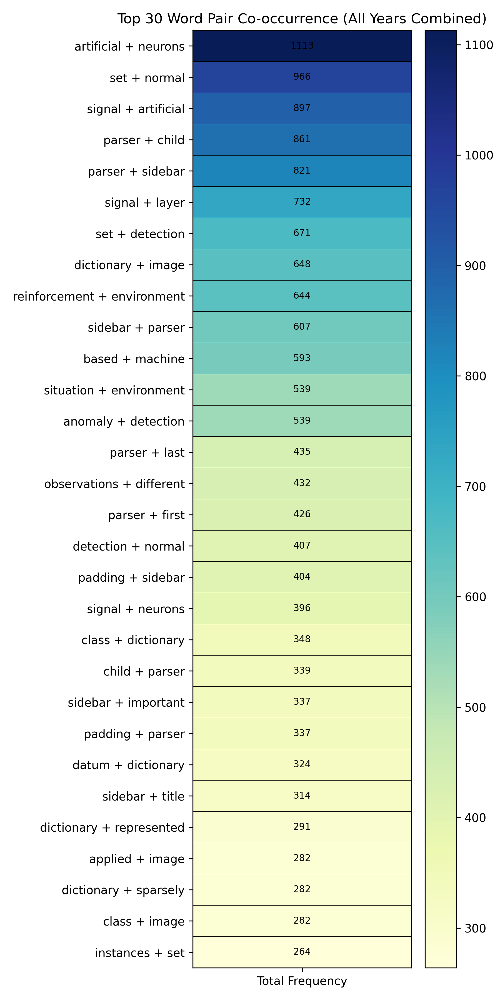
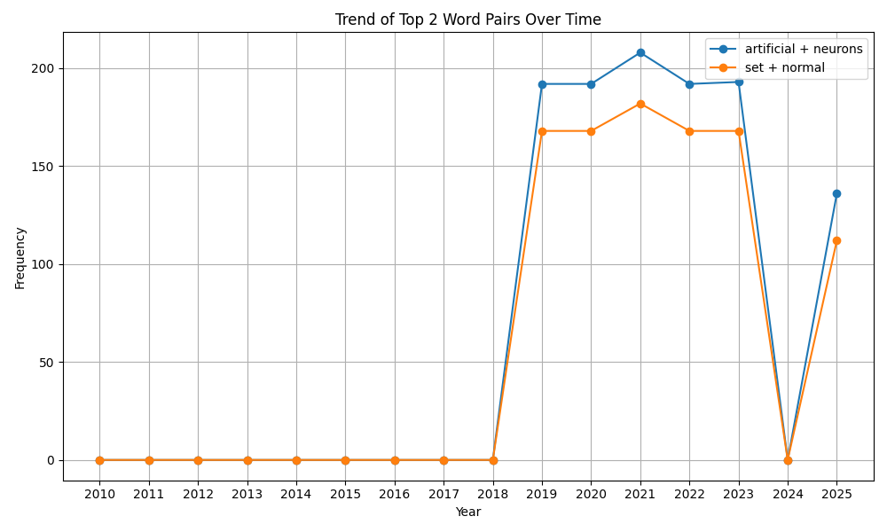

[](https://www.gnu.org/software/bash/)
[](https://www.python.org/)
[](https://hadoop.apache.org/docs/current/hadoop-streaming/HadoopStreaming.html)
[](https://spark.apache.org/)

# Wikipedia Machine Learning Article Evolution Analysis

This project analyzes the historical evolution of the Wikipedia "Machine learning" article using a combination of shell scripts, Hadoop streaming, and Apache Spark. It extracts article revisions, parses content, and computes co-occurrence and n-gram statistics over time.

---

## 📁 Project Structure

```
.
├── data                        # Contains articles about ml crawled from Wikipedia
├── hadoop
│   ├── scripts
│   │   ├── hadoop_setup.sh     # Download & install Hadoop
│   │   ├── upload_to_hdfs.sh   # Upload articles' text file to Hadoop
│   │   ├── run_bigram.sh       # Run mapper&reducer to analyse bigram
│   │   └── run_cooccur.sh       # Run mapper&reducer to analyse co-occurrence
│   └── streaming
│   │   ├── mapper_cooccur.py
│   │   ├── reducer_cooccur.py
│   │   ├── mapper_bigram.py
│   │   ├── reducer_bigram.py
│   │   └── combiner_bigram.py
├── README.md
├── scripts
│   ├── data_collection.py
│   ├── generate_article_ids.py # Choose 1 article in 1 month since 2020
│   ├── download.sh             # Get Wikipedia html based on article ids
│   └── parse_article.sh        # Parse raw ml html to text and clean
├── spark
│   ├── scripts
│   │   └── spark_setup.sh      # Install & configure spark
│   └── streaming
│   │   ├── map_reducer_coocur.py
│   │   └── map_reducer_ngram.py
├── analysis
│   ├── heatmap_utils.py        # Load data from csv file
│   ├── heatmap_plot.py         # Plot heatmap of co-occurrence pairs
│   └── trend_plot.py           # Plot trend of top 2 co-occurrence pairs
├── artifacts                   # Store generated csv files and images
└── stopwords.txt
```

---

## ⚙️ Setup Instructions

1. Clone the repository and navigate to the project root.

2. Prepare data <br>    
    Generate article revision IDs:
   ```bash
   python scripts/generate_article_ids.py
   ```

    Download and parse Wikipedia articles:
   ```bash
   python scripts/data_collection.py
   ```

3. Install dependencies:
   ```bash
   pip install -r requirements.txt
   ```

4. Download and extract Spark (for Spark part) :
   ```bash
   bash spark/scripts/spark_setup.sh
   ```

5. Download and set up Hadoop (for Hadoop part):
   ```bash
   bash hadoop/scripts/hadoop_setup.sh
   ```

6. Upload article files to hdfs (for Hadoop part):
   ```bash
   bash upload_to_hdfs.sh
   ```

---

## 🚀 Analysis Scripts

### Co-occurrence Analysis (Spark)

Compute word pair co-occurrence frequencies per year:

```bash
spark-submit spark/streaming/map_reducer_coocur.py
```

### N-gram Analysis (Spark)

Compute n-gram frequencies per year (change the argument --n):

```bash
spark-submit spark/streaming/map_reducer_ngram.py --n 3
```

---

## 🚀 Analysis Scripts

### Co-occurrence Analysis (Hadoop)

Compute word pair co-occurrence frequencies:

```bash
bash hadoop/scripts/run_coocur.py
```

### 2-gram Analysis (Hadoop)

Compute 2-gram frequencies:

```bash
bash hadoop/scripts/run_bigram.py
```

---

## 📈 Usage

This project explores the evolution of Wikipedia language by analyzing co-occurrence patterns and n-gram frequencies across different time periods. By examining how word pairs and sequences change over time, we gain insights into linguistic trends and topic shifts in Wikipedia edits.

🔥 Plot the heatmap of co-occurrence pairs:
```bash
python analysis/heatmap_plot.py
```
The output will be like this:



🔥 Plot the trend of top 3 co-ocur pairs:
```bash
python analysis/trend_plot.py
```
The output will be like this:



It provides a data-driven lens into:

- The evolution of terminology in machine learning

- The rise and fall of specific concepts or techniques

- The linguistic dynamics of Wikipedia as a living, collaborative corpus

These insights offering researchers and language analysts a way to explore how knowledge is framed and communicated over time. 


For example, the heatmap visualizes the frequency of word pairs (co-occurrence) aggregated across selected Wikipedia snapshots. Each cell represents how often a specific word pair appears, allowing us to identify dominant linguistic patterns and emerging terminology.


